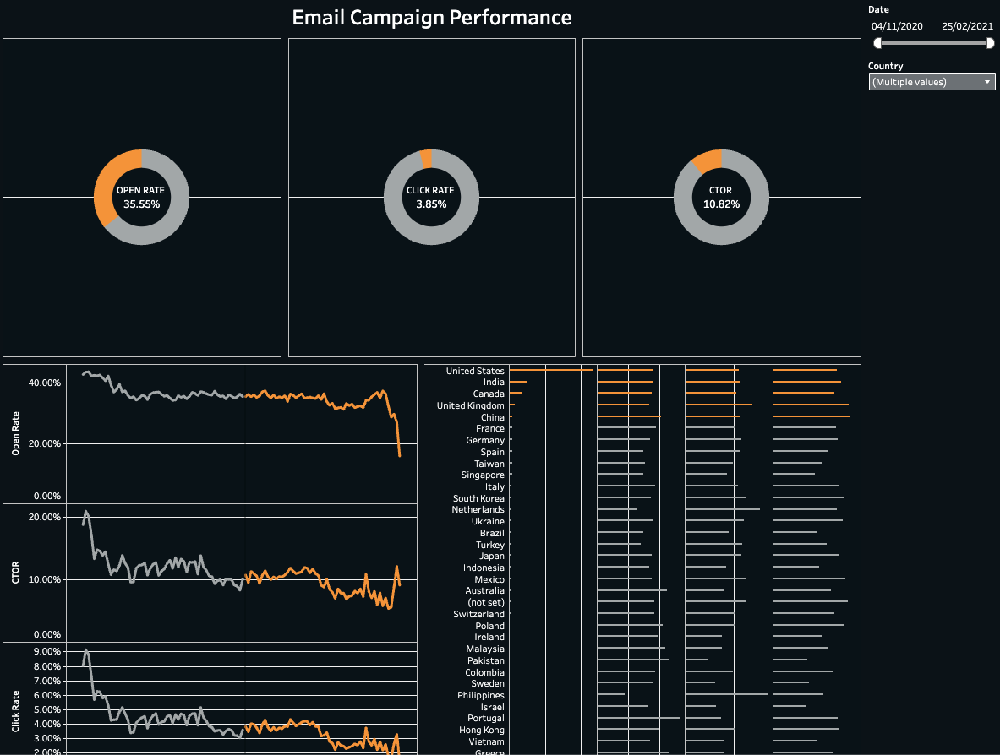

# Email Campaign Performance Dashboard
Tableau dashboard analyzing email campaign performance, engagement metrics, and user interaction across countries.

## Dashboard Preview

## Business Task
Analyze email campaign performance using open rate, click rate, and click-to-open rate (CTOR) to understand user engagement and campaign effectiveness.

## Tools
Tableau, Data Visualization, Dashboard Design, KPI Analysis 

## Key Insights
- The average open rate is around 35% across campaigns.
- Click rate is significantly lower than open rate.
- Engagement metrics vary across countries.
- Email performance metrics change over time.
- Some periods show noticeable drops in engagement.
  
## Interactive Dashboard
[View the interactive dashboard on Tableau Public](https://public.tableau.com/views/EmailCampaignPerformance_17729925443980/EmailMetrics?:language=en-GB&:sid=&:redirect=auth&:display_count=n&:origin=viz_share_link)
